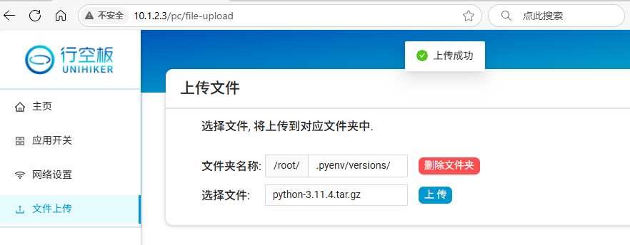

# 说明

pyenv是一个方便管理python版本的工具，

本仓库存储行空板上pyenv加载的环境包，可以直接下载文件解压到pyenv的环境中，避免长时间下载。


# 使用方法

## 1.在行空板上安装pyenv环境

- 行空板联网

- 国内需切换apt源，下载更快

  在行空板终端运行命令。

  ```
  mv /etc/apt/sources.list /etc/apt/sources.list.bak
  ls /etc/apt/
  ```

  ```
  sudo tee /etc/apt/sources.list > /dev/null <<EOF
  deb http://mirrors.tuna.tsinghua.edu.cn/debian/ buster main contrib non-free
  deb http://mirrors.tuna.tsinghua.edu.cn/debian/ buster-updates main contrib non-free
  deb http://mirrors.tuna.tsinghua.edu.cn/debian/ buster-backports main contrib non-free
  deb http://mirrors.tuna.tsinghua.edu.cn/debian-security buster/updates main contrib non-free
  EOF
  
  ```

  ```
  #更新软件包索引
  sudo apt update
  ```

  

- 安装pyenv工具

  在行空板终端运行命令。
  
  ```
  #安装依耐库
  sudo apt install -y make build-essential libssl-dev zlib1g-dev \
  libbz2-dev libreadline-dev libsqlite3-dev wget curl llvm \
  libncurses5-dev libncursesw5-dev xz-utils tk-dev libffi-dev liblzma-dev
  
  #安装pyenv
  curl https://pyenv.run | bash
  
  #pyenv添加到系统配置中
  echo 'export PYENV_ROOT="$HOME/.pyenv"' >> ~/.bashrc
  echo '[[ -d $PYENV_ROOT/bin ]] && export PATH="$PYENV_ROOT/bin:$PATH"' >> ~/.bashrc
  echo 'eval "$(pyenv init -)"' >> ~/.bashrc
  
  #配置生效
  source ~/.bashrc
  
  #查看pyenv版本，有版本号即安装成功
  pyenv --version
  
  ```


## 2.下载预编译文件传入行空板

- 下载需要的python版本对应编译后的tar.gz文件，本教材以3.11.4为例则下载python-3.11.4.tar.gz:
  - 下载路径一:  github releases：https://github.com/liliang9693/unihiker-pyenv-python/releases
  - 下载路径二:  百度网盘： https://pan.baidu.com/s/171Qao8nwvjqZdT1iYHFb_w?pwd=pyen 

- 上传到行空板上pyenv路径下，即```/root/.pyenv/versions/```




## 3.安装版本

在行空板终端运行命令。

```
#进入文件目录
cd /root/.pyenv/versions/
#解压到当前文件夹，如果下载的是其他文件，则应该修改为对应文件名
tar -xzf python-3.11.4.tar.gz
#查看文件目录清单，应该列出3.11.4文件夹
ls
#刷新pyenv的python列表，无输出
pyenv rehash
#列出识别到的版本，此时应该会输出system和3.11.4
pyenv versions
#设置3.11.4为全局默认python
pyenv global 3.11.4
#列出版本，此时3.11.4前面有个*表示被选中了
pyenv versions
#查看python版本，应该输出Python 3.11.4，表示切换版本成功
python --version
#查看pip库清单。应该只输出pip和setuptools，表示这是一个全新的python环境，可以安装自己需要的库
pip list
```

## 备注

- 1只用操作一次即可。重复2和3可以安装更多版本的Python
- 安装新的Python环境之后，如果需要使用MInd+图形化相关功能，需要手动安装响应的库

- 切换回系统自带的Python3.7的方法

```
pyenv global system
```

