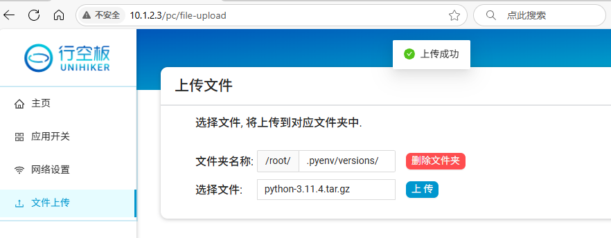

# Instructions

pyenv is a convenient tool for managing Python versions.

This repository stores the environment packages loaded by pyenv on the UNIHIKER. You can directly download the files and extract them into the pyenv environment to avoid lengthy downloads.

# Usage

## 1. Install pyenv on UNIHIKER

- Connect UNIHIKER to the internet.

- Install the environment:

  ```
  # Update package index
  sudo apt update
  # Install dependencies
  sudo apt install -y make build-essential libssl-dev zlib1g-dev \
  libbz2-dev libreadline-dev libsqlite3-dev wget curl llvm \
  libncurses5-dev libncursesw5-dev xz-utils tk-dev libffi-dev liblzma-dev
  
  # Install pyenv
  curl https://pyenv.run | bash
  
  # Add pyenv to system configuration
  echo 'export PYENV_ROOT="$HOME/.pyenv"' >> ~/.bashrc
  echo '[[ -d $PYENV_ROOT/bin ]] && export PATH="$PYENV_ROOT/bin:$PATH"' >> ~/.bashrc
  echo 'eval "$(pyenv init -)"' >> ~/.bashrc
  
  # Apply configuration
  source ~/.bashrc
  
  # Check pyenv version. If a version number appears, installation is successful.
  pyenv --version
  ```


## 2. Downloa & Install 

```
# Navigate to the directory
cd /root/.pyenv/versions/
# Download the Python package file using the tar.gz link from the releases page.
wget https://github.com/liliang9693/unihiker-pyenv-python/releases/download/3.8.5%263.11.4%263.12.7/python-3.11.4.tar.gz
# Extract the file to the current folder
tar -xzf python-3.11.4.tar.gz
# List directory contents. The output should include the 3.11.4 folder.
ls
# Refresh pyenv's Python list (no output expected)
pyenv rehash
# List detected versions. The output should show system and 3.11.4.
pyenv versions
# Set 3.11.4 as the global default Python
pyenv global 3.11.4
# List versions. The selected version (3.11.4) will be marked with a *.
pyenv versions
# Check Python version. The output should be Python 3.11.4, indicating successful version switch.
python --version
# List pip packages. Only pip and setuptools should appear, indicating a fresh Python environment ready for custom package installations.
pip list
```

## Notes

- Step 1 only needs to be performed once. Repeat steps 3 to install additional Python versions.
- After installing a new Python environment, if you need to use Mind+ graphical features, manually install the required libraries.

- To switch back to the system's default Python 3.7:

```
pyenv global system
```


# 说明

pyenv是一个方便管理python版本的工具，

本仓库存储行空板上pyenv加载的环境包，可以直接下载文件解压到pyenv的环境中，避免长时间下载。


# 使用方法

## 1.在行空板上安装pyenv环境

- 行空板联网

- 国内需切换apt源，下载更快

  ```
  mv /etc/apt/sources.list /etc/apt/sources.list.bak
  ls /etc/apt/
  ```
  
  ```
  sudo tee /etc/apt/sources.list > /dev/null <<EOF
  deb http://mirrors.tuna.tsinghua.edu.cn/debian/ buster main contrib non-free
  deb http://mirrors.tuna.tsinghua.edu.cn/debian/ buster-updates main contrib non-free
  deb http://mirrors.tuna.tsinghua.edu.cn/debian/ buster-backports main contrib non-free
  deb http://mirrors.tuna.tsinghua.edu.cn/debian-security buster/updates main contrib non-free
  EOF
  
  ```

  ```
  #更新软件包索引
  sudo apt update
  ```

  

- 安装环境

  ```
  #安装依耐库
  sudo apt install -y make build-essential libssl-dev zlib1g-dev \
  libbz2-dev libreadline-dev libsqlite3-dev wget curl llvm \
  libncurses5-dev libncursesw5-dev xz-utils tk-dev libffi-dev liblzma-dev
  
  #安装pyenv
  curl https://pyenv.run | bash
  
  #pyenv添加到系统配置中
  echo 'export PYENV_ROOT="$HOME/.pyenv"' >> ~/.bashrc
  echo '[[ -d $PYENV_ROOT/bin ]] && export PATH="$PYENV_ROOT/bin:$PATH"' >> ~/.bashrc
  echo 'eval "$(pyenv init -)"' >> ~/.bashrc
  
  #配置生效
  source ~/.bashrc
  
  #查看pyenv版本，有版本号即安装成功
  pyenv --version
  
  ```


## 2.下载预编译文件传入行空板

- 在本仓库下载需要的版本对应tar.gz文件包，例如```python-3.11.4.tar.gz```

- 上传到行空板上pyenv路径下，即```/root/.pyenv/versions/```




## 3.安装版本


```
#进入文件目录
cd /root/.pyenv/versions/
#解压到当前文件夹
tar -xzf python-3.11.4.tar.gz
#查看文件目录清单，应该列出3.11.4文件夹
ls
#刷新pyenv的python列表，无输出
pyenv rehash
#列出识别到的版本，此时应该会输出system和3.11.4
pyenv versions
#设置3.11.4为全局默认python
pyenv global 3.11.4
#列出版本，此时3.11.4前面有个*表示被选中了
pyenv versions
#查看python版本，应该输出Python 3.11.4，表示切换版本成功
python --version
#查看pip库清单。应该只输出pip和setuptools，表示这是一个全新的python环境，可以安装自己需要的库
pip list
```

## 备注

- 1只用操作一次即可。重复2和3可以安装更多版本的Python
- 安装新的Python环境之后，如果需要使用MInd+图形化相关功能，需要手动安装响应的库

- 切换回系统自带的Python3.7的方法

```
pyenv global system
```

